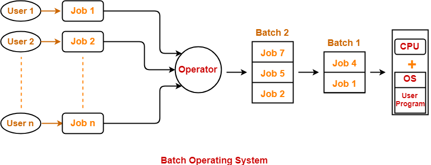

# Batch Processing
In the beginning, the OS was not too smart. On old mainframe systems, there were such APIs provided so programmersdid not have to write low-level I/O code. The so-called OS on these systems could only run on program at a time and were controlled by a human (operator). 

Users would have to prepare jobs using [punch cards](https://en.wikipedia.org/wiki/Punched_card) and submit them to the operator. Later on, the operator would collect similar jobs from different users and sort them into batches. Operator then submits those batches one by oneand the system would process all the required operations for jobs grouped in a batch together.

#### Advantages
* Manages large repeated work in the absence of humans, no human intervention is needed 

#### Disadvantages
* Difficult to debug batches
* One job could affect other jobs in the same patch

